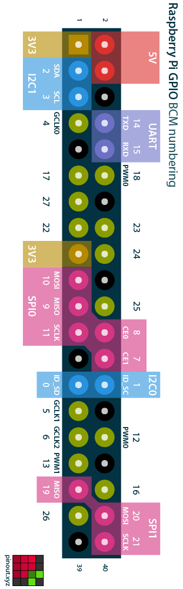
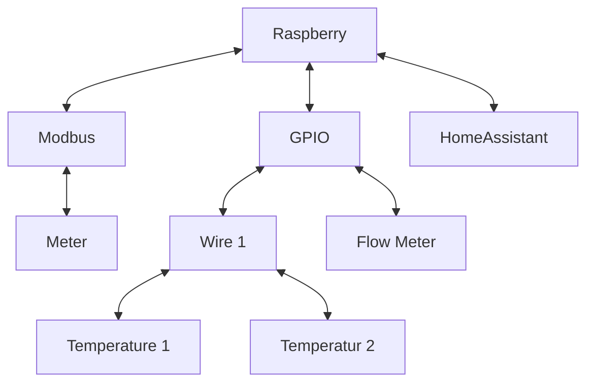

# Default PCB
___

### Pinout:

| Pin    | Type         | Description        |
|--------|--------------|--------------------|
| GPIO04 | INPUT/WIRE 1 | X2.1 (Temperature) |
| GPIO05 | OUT/PWM      | Led 2 (P2)         |
| GPIO06 | INPUT        | X2.3 (Flow Sensor) |
| GPIO12 | OUT/PWM      | Led 1 (P1)         |
| GPIO13 | OUT/PWM      | SCR In             |
| GPIO17 | INPUT        | SCR Betrieb        |
| GPIO22 | INPUT        | Button 1 (S2)      |
| GPIO26 | INPUT        | Button 2 (S3)      |
| GPIO27 | INPUT        | SCR Störung        |

