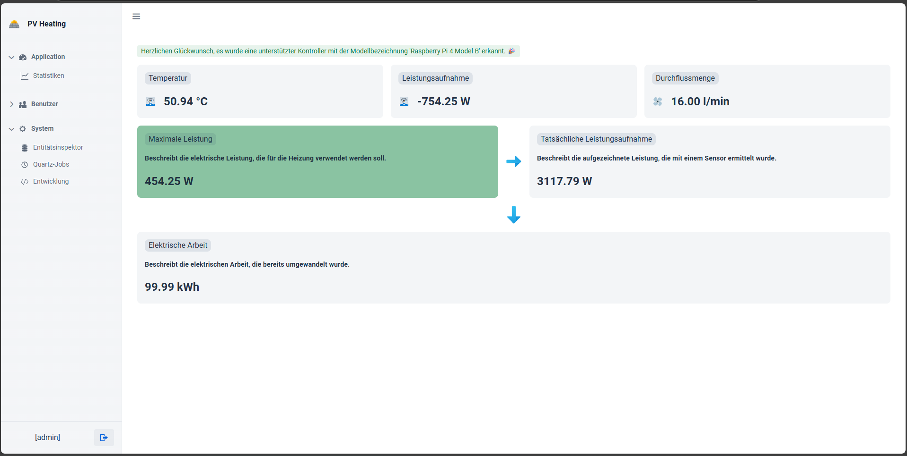

# PV Heating

PV Heating bietet die Möglichkeit, ein Heizelement stufenlos zu regeln.

Hierbei wird ein sogenannter SCR (Thyristorensteller) verwendet.

Ziel der Software ist es, die Nulleinspeisung zu revolutionieren.


## Demo




## Authors

- [@Gamer08YT](https://www.github.com/Gamer08YT)


## Features

- Benutzerverwaltung
    - Rollen basiert
    - Level basiert
- Modernes Framework (JMIX/Vaadin)


## Roadmap

- Raspberry Support
  - SCR Regelung
    - PWM
    - Current
    - Voltage
  - Temperaturfühler
  - Relais Ausgang
  - Dynamische GPIO Belegungen
- Updater
- VPN Access/Proxy (Für SmartHome Anwendung)

## API Reference

#### Get all items

```http
  GET /api/items
```

| Parameter | Type     | Description                |
| :-------- | :------- | :------------------------- |
| `api_key` | `string` | **Required**. Your API key |

#### Get item

```http
  GET /api/items/${id}
```

| Parameter | Type     | Description                       |
| :-------- | :------- | :-------------------------------- |
| `id`      | `string` | **Required**. Id of item to fetch |

#### add(num1, num2)

Takes two numbers and returns the sum.

